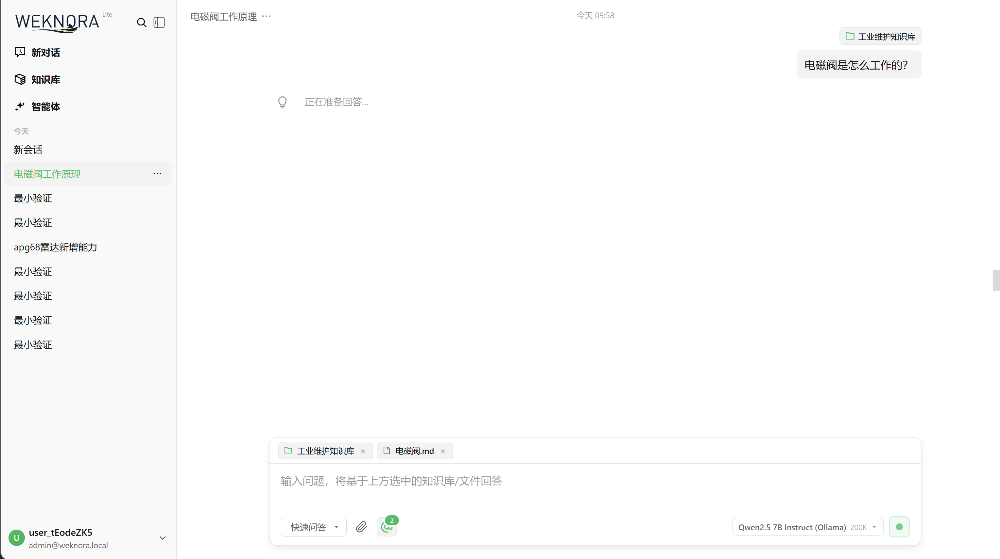
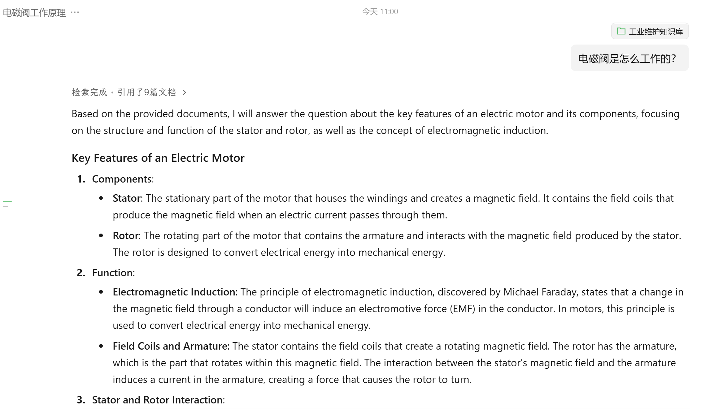
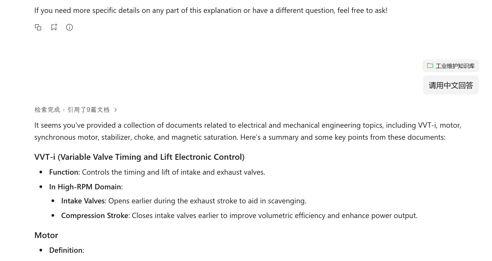

# 测试记录

> 用例设计、预期答案要点与判定标准见 `2026-09-10_weknora-浏览器功能测试计划.md`，
> 该文档第三章含逐条结果与失败项原文。本文只做汇总与结论。
>
> 执行人：lfloat。执行时间：2026-09-10 13:00 之后，前两轮失败发生在同日 09:58 与 11:00。
> 执行方式：2.1 至 2.6 经接口逐条执行，2.7 引用交互在真实浏览器中操作，
> 2.8 依据全部 14 条回答统计。复现命令见第八章。

---

## 一、结论

**21 条用例：20 通过，1 失败。**

| 分组 | 覆盖内容 | 结果 |
|---|---|---|
| 2.1 A1–A3 | 单文档事实检索 | 3/3 通过 |
| 2.2 B1–B2 | 跨文档对比与归纳 | 2/2 通过 |
| 2.3 C1–C2 | 因果与诊断 | 2/2 通过 |
| 2.4 D1–D2 | 概念与安全 | 2/2 通过 |
| 2.5 E1 | 数值读取 | 1/1 通过 |
| 2.6 F1–F3 | 拒答能力（单轮） | 3/3 通过 |
| 2.7 G1–G4 | 引用交互 | 4/4 通过 |
| 2.8 H1–H4 | 幻觉与残留缺陷 | 3 通过，H3 失败 |

## 二、环境前提

结论只在以下条件下成立，条件变化需重测：

- 后台索引已全部完成（300 篇 `summary_status` 均为 `completed`）。
  **索引未完成时测试结论不可信**，会表现为长时间无回复。
- Ollama 以 `OLLAMA_NUM_PARALLEL=1` 运行，`WEKNORA_MODEL_MAX_CONCURRENCY=2`。
- 智能体 `builtin-quick-answer`：上下文模板 `detailed_context`、`embedding_top_k=5`、
  系统提示词已移除图片规则。三项都不是默认值，缺任一项结果都会不同。

## 三、正面结论

**检索与引用链路可靠**，这是本次测试的核心目的：

- 各题产出的 19 个去重引用，逐一调用浮层实际使用的接口
  `GET /api/v1/chunks/by-id/{chunkId}`，**19/19 均返回非空原文**，无失效引用。
- 引用原文与答案要点逐条对应：A2 命中「接触器」「双金属」，B1 同时命中三种制动方式，
  C1 命中「轴电压」「绝缘轴承」，E1 命中「1996」「株洲」。无引用指向无关内容。
- 浏览器实测：内联引用渲染为 `span.citation.citation-kb`，浮层正常弹出（320×242），
  标题与正文均为对应分块；B1 的三条引用各自独立弹出，分别指向三个不同文档。
- 「引用了 N 篇文档」的计数与展开列表一致（E1 显示 2 篇，展开确为 2 篇）。
  该计数取按文档去重后的数量，与召回分块数、答案内联引用数是三个不同的量。

**语义检索生效**：C1 的提问与文档标题「轴电压」无任何字面重叠，仍正确召回，
并给出成因加四项防护措施。

**响应速度正常**：修复并发配置后，单次问答 6.8 至 11 秒，首字 2.6 秒。
修复前同一问题耗时 11 分 16 秒。

## 四、唯一失败项：H3

**用例**：在 C1 的同一会话中追问「刚才说的绝缘轴承装在哪一端？」，语料中无此信息，
预期应说明无法回答。

**结果**：两轮均未拒答，且编造内容不同。首轮检索返回 0 条，断言「一般安装在电机的
非接地端」「靠近变频器的一侧」；复测轮检索返回 4 条，改称「根据提供的参考材料，
绝缘轴承可以安装在电机的任意一端」。

**核对**：被引用的两个分块（`62285a26`、`b99d703d`）原文只说明「可透过轴的接地电刷、
马达框架接地、使用绝缘轴承或屏蔽电缆而避免」，**完全未提及安装在哪一端**。
两轮都为编造事实附上了引用。

**判定失败依据**：判定原则中的「凭空增加语料中不存在的事实」。

**性质**：与是否检索到材料无关（0 条与 4 条都失败），而是追问场景下模型倾向沿着
上一轮话题继续作答。与 F1 至 F3 单轮拒答全部正常形成鲜明对比——单轮守得住，追问守不住。

## 五、通过但有瑕疵的项

这些不影响判定，但会影响使用体验，接手后建议关注：

| 编号 | 瑕疵 |
|---|---|
| A1 | 稳定漏掉原文的「4-20mA 直流」，两轮均漏。属详略差异不计失败，但与 E1 能读出年份形成对比 |
| A1、A3、D1、F3 | 未产出可交互引用标记。复测显示 A3 由 0 变 3、D1 由 0 变 2，说明是逐次随机波动而非题目固有属性 |
| A1、A2、A3、C2 | 内部句柄泄漏或标记格式错误：`文档 d1`、`<cite id="c1"/>`、多余的 `</ref>` |
| B2 | 对涡流制动先称「也能够回收能量」随即改口称资料未说明，前后自相矛盾 |
| F1 | 正确拒答，但附了一条指向无关文档的引用 |
| F3 | 正确拒答，但补了一句「两者都是工业自动化领域的通信标准」，属先验知识渗出 |

## 六、一个曾被误判为缺陷的现象

展开引用面板时出现三处「图片无法显示 预览」，一度像是图片幻觉复发。
查证结果：来源是隐藏的上传遮罩组件 `/assets/upload-mask-CXovx3bg.svg`，
该资源实际返回 200、文件也在 `web/assets/` 中，`naturalWidth===0` 对无固有尺寸的 SVG
是误报，答案区并未出现该占位符。H1 结论不变，14 条回答确实无任何图片。

记录此条是为了避免下次重复排查。

## 七、前两轮失败与修复

A1 在前两轮均失败，两次都不是模型能力问题，处置过程见测试计划文档第三章
「测试条件与修复过程」，根因分析见 `问题与解决.md`：

1. 首轮 09:58 长时间无回复 —— 后台摘要任务把 Ollama 队列堵满，实为排队。
   该题答案在 11 分 16 秒后才写入数据库。

   

2. 第二轮 11:00 英文作答且答非所问 —— 上下文模板 `default_context` 把用户问题
   放在「非指令」块之下，模型改为总结检索结果并自拟问题，同时丢失语言锚点。
   对话中追加「请用中文回答」进入同一个块，故无效。

   

   

3. 图片幻觉 —— 提示词要求必须含图，且此前的模板修改从未落到已入库的智能体上。

更早的一轮问题记录在 `0910-weknora-test.md`，含知识库命名乱码与图片显示异常两项
的原始截图，两项均已修复。

## 八、可复现的核对命令

以下命令用于复核本文的结论。执行前确认服务已启动，地址默认为
`http://127.0.0.1:8080`。

取令牌，Lite 形态免密：

```bash
TOKEN=$(curl -s -X POST http://127.0.0.1:8080/api/v1/auth/auto-setup \
  -H 'Content-Type: application/json' -d '{}' \
  | python -c "import sys,json,re;print(re.search(r'\"(?:access_)?token\":\"([^\"]{20,})\"',sys.stdin.read()).group(1))")
```

核对第二章的环境前提，即 300 篇是否全部索引完成：

```bash
curl -s -H "Authorization: Bearer $TOKEN" http://127.0.0.1:8080/api/v1/knowledge-bases
curl -s -H "Authorization: Bearer $TOKEN" \
  "http://127.0.0.1:8080/api/v1/knowledge-bases/<知识库ID>/knowledge?page=1&page_size=1000"
```

返回中每条的 `parse_status`、`summary_status` 应为 `completed`，`enable_status` 应为
`enabled`。也可直接查库，见 `操作说明.md` 第 6.2 节的 SQL。

核对第三章「19/19 引用均返回非空原文」这一结论，逐个分块 ID 调用浮层实际使用的
接口：

```bash
curl -s -H "Authorization: Bearer $TOKEN" \
  http://127.0.0.1:8080/api/v1/chunks/by-id/<分块ID>
```

核对第四章 H3 的失败依据，取该题引用的两个分块原文：

```bash
for id in 62285a26 b99d703d; do
  curl -s -H "Authorization: Bearer $TOKEN" \
    "http://127.0.0.1:8080/api/v1/chunks/by-id/$id"
done
```

上述两个 ID 为原文中记录的前缀，实际调用需替换为完整 ID。返回内容应只提到
「可透过轴的接地电刷、马达框架接地、使用绝缘轴承或屏蔽电缆而避免」，
不含安装位置信息。

第 2.7 组引用交互需在浏览器中操作，无对应的接口复现方式。
